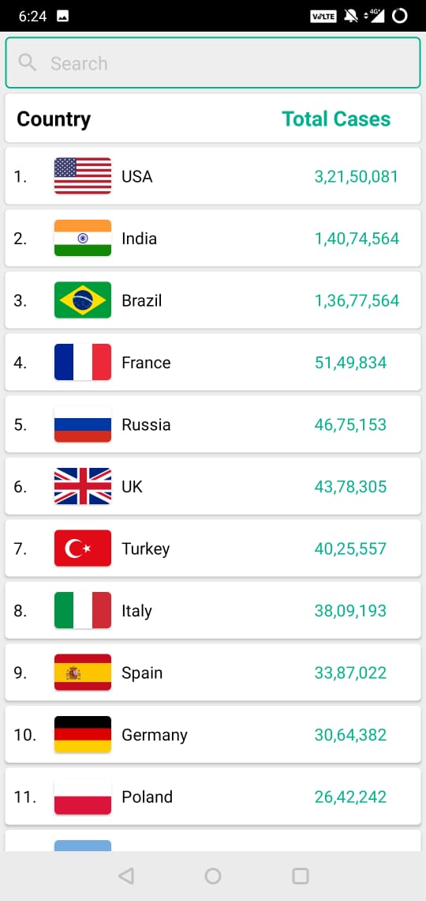

# Covid19 Tracker App
## Mobile_Computing_and_App_Development_Project

###  **Lets stay safe together**   

### Take a break from the news.  
### Information overload can be upsetting. We'll provide you with all the needed information regarding Covid-19.  
### ANYTIME ANYWHERE!  
  
#### To be noted:  
Statistics are updated as and when data on the api's used is updated.  
__API used:__  
For India : https://api.covid19india.org/data.json  
For Country Wise : https://corona.lmao.ninja/v2/countries  
For World Data : https://corona.lmao.ninja/v2/all  
__Helplines:__  
The Call and Whatsapp helpline numbers are only for use in Bangalore, Karnataka, India.  

Main Screen             |  Symptoms Screen
:-------------------------:|:-------------------------:
 |     
India Statistics Screen             |  Countries List with Cases
:-------------------------:|:-------------------------:
  |     

Check Screenshots folder for more screenshots of the app

